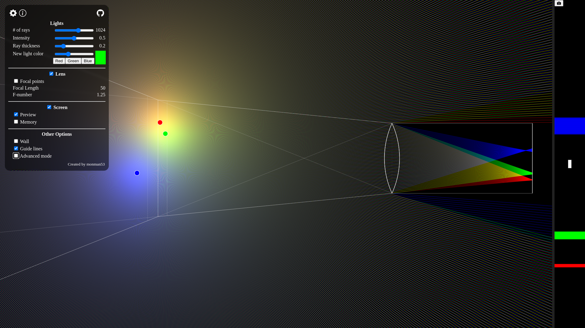

# Simple Camera Simulator

An interactive tools for understanding how camera works.

Visit https://monman53.github.io/simple-camera-simulator/ .

## Screenshot



## Development

```sh
npm install

# Compile and Hot-Reload for Development
npm run dev

# Type-Check, Compile and Minify for Production
npm run build
```
